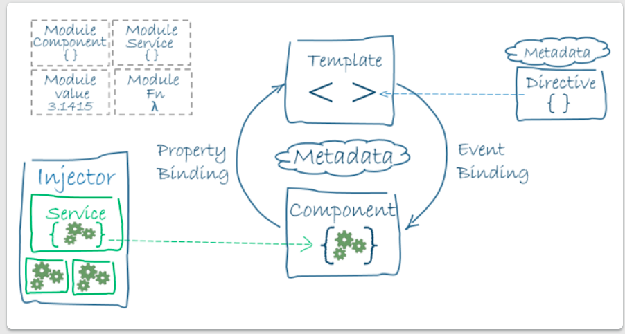
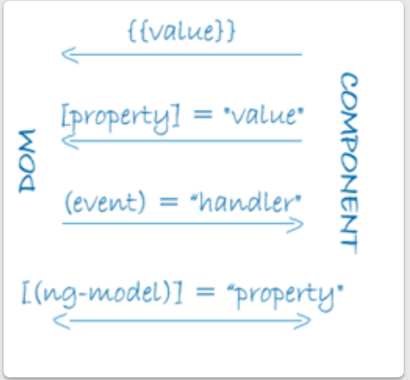
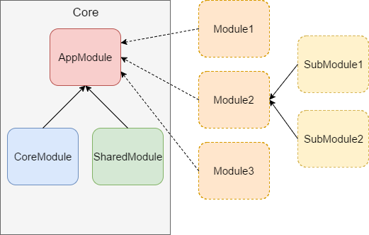
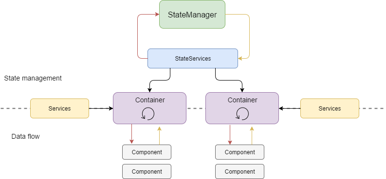

[TOC]

# Basic Syntax

- `*ngFor`
- `*ngIf`
- Interpolation `{{ }}`
- Property binding `[ ]`
- Event binding `( )`

## Architecture Overview



## Two-way binding

```html
<div>
  <label>name:
    <input [(ngModel)]="hero.name" placeholder="name"/>
  </label>
</div>
```

**[(ngModel)]** is Angular's two-way data binding syntax.

Here it binds the `hero.name` property to the HTML textbox so that data can flow *in both directions:* from the `hero.name` property to the textbox, and from the textbox back to the `hero.name`.

> Although `ngModel` is a valid Angular directive, it isn't available by default.
>
> It belongs to the optional `FormsModule` and you must *opt-in* to using it.


## Event types in Angular

```typescript
(click)="myFunction()"      
(dblclick)="myFunction()"   
(submit)="myFunction()"
(blur)="myFunction()"  
(focus)="myFunction()" 
(scroll)="myFunction()"
(cut)="myFunction()"
(copy)="myFunction()"
(paste)="myFunction()"
(keyup)="myFunction()"
(keypress)="myFunction()"
(keydown)="myFunction()"
(input)? where is it from?
(mouseup)="myFunction()"
(mousedown)="myFunction()"
(mouseenter)="myFunction()"
(drag)="myFunction()"
(drop)="myFunction()"
(dragover)="myFunction()"
```


# Components

A component consists of three things:

- **A component class** that handles data and functionality. In the previous section, the product data and the `share()` method in the component class handle data and functionality, respectively.
- **An HTML template** that determines the UI. In the previous section, the product list's HTML template displays the name, description, and a "Share" button for each product.
- **Component-specific styles** that define the look and feel. Though product list does not define any styles, this is where component CSS resides.

> The most different part from React is that components in Angular are more like "MVC"


Components shouldn't fetch or save data directly and they certainly shouldn't knowingly present fake data. They should focus on presenting data and delegate data access to a service.

## Input

Parent components pass their information to child components via `property`. Either way, the `@Input` decorator tells Angular that this property is *public* and available for binding by a parent component. Without `@Input`, Angular refuses to bind to the property.


```typescript
import { Component, OnInit } from '@angular/core';
import { Input } from '@angular/core';
export class ProductAlertsComponent implements OnInit {
  @Input() product;
  constructor() { }

  ngOnInit() {
  }

}
```

## Output

```javascript
import { Component } from '@angular/core';
import { Input } from '@angular/core';
import { Output, EventEmitter } from '@angular/core';
export class ProductAlertsComponent {
  @Input() product;
  @Output() notify = new EventEmitter();
}
```


## Styles

You define private styles either inline in the `@Component.styles` array or as stylesheet file(s) identified in the `@Component.styleUrls` array.

 The Angular [class binding](https://angular.io/guide/template-syntax#class-binding) makes it easy to add and remove a CSS class conditionally. Just add `[class.some-css-class]="some-condition"` to the element you want to style.

```html
<li *ngFor="let hero of heroes"
  [class.selected]="hero === selectedHero"
  (click)="onSelect(hero)">
  <span class="badge">{{hero.id}}</span> {{hero.name}}
</li>
```


## Data binding




## Directives

We integrate the operations about DOM into `directives`. Here are two other kinds of directives: *structural* and *attribute*. In templates, directives typically appear within an element tag as attributes, either by name or as the target of an assignment or a binding.

> You can apply many *attribute* directives to one host element. You can [only apply one](https://angular.io/guide/structural-directives#one-per-element) *structural* directive to a host element.
>
> ?
>
> from Angular - documentation 

### Structural directives

*Structural directives* are responsible for HTML layout. They shape or reshape the DOM's *structure*, typically by adding, removing, or manipulating elements.

- `*ngFor`
- `*ngIf`

### Attribute directives

*Attribute directives* alter the appearance or behavior of an existing element. In templates they look like regular HTML attributes, hence the name.

The `@Directive` decorator's lone configuration property specifies the directive's [CSS attribute selector](https://developer.mozilla.org/en-US/docs/Web/CSS/Attribute_selectors), `[appHighlight]`.

You use the `ElementRef` in the directive's constructor to [inject](https://angular.io/guide/dependency-injection) a reference to the host DOM element, the element to which you applied `appHighlight`. `ElementRef` grants direct access to the host DOM element through its `nativeElement` property.

```typescript
import { Directive, ElementRef, HostListener, Input } from '@angular/core';

@Directive({
  selector: '[appHighlight]'
})
export class HighlightDirective {

  constructor(private el: ElementRef) { }

  @Input('appHighlight') highlightColor: string;

  @HostListener('mouseenter') onMouseEnter() {
    this.highlight(this.highlightColor || 'red');
  }

  @HostListener('mouseleave') onMouseLeave() {
    this.highlight(null);
  }

  private highlight(color: string) {
    this.el.nativeElement.style.backgroundColor = color;
  }
}
```

The `@HostListener` decorator lets you subscribe to events of the DOM element that hosts an attribute directive, the `<p>` in this case.

### @input

```typescript
@Input('appHighlight') highlightColor: string;
```

*Inside* the directive the property is known as `highlightColor`. *Outside* the directive, where you bind to it, it's known as `appHighlight`.

You can also add another property in the same `directive` 

Angular knows that the `defaultColor` binding belongs to the `HighlightDirective` because you made it *public* with the `@Input` decorator.


## Dynamic Components

The `<ng-template>` element is a good choice for dynamic components because it doesn't render any additional output.


# NgModule

Every component must be declared in *exactly one* [NgModule](https://angular.io/guide/ngmodules).

*You* didn't declare the `HeroesComponent`. So why did the application work? It worked because the Angular CLI declared `HeroesComponent` in the `AppModule` when it generated that component. Open `src/app/app.module.ts` and find `HeroesComponent` imported near the top.

# Pipes

[Pipes](https://angular.io/guide/pipes) are a good way to format strings, currency amounts, dates and other display data. Angular ships with several built-in pipes and you can create your own.

> Note that the `pipes` here mean the "small directives" used in interpolation to handle string etc. 
>
> In `Observable` section, there is another concept called `pipe`, which combines several operations working on the value returned from observable. 

```html
<h2>{{hero.name | uppercase}} Details</h2>
```

## AsyncPipe

```html
<li *ngFor="let hero of heroes$ | async" >
```

> The `*ngFor` repeats hero objects. Notice that the `*ngFor` iterates over a list called `heroes$`, not `heroes`. The `$` is a convention that indicates `heroes$` is an `Observable`, not an array.

Since `*ngFor` can't do anything with an `Observable`, use the pipe character (`|`) followed by `async`. This identifies Angular's `AsyncPipe` and subscribes to an `Observable` automatically so you won't have to do so in the component class.

# Routing

In Angular, the best practice is to load and configure the router in a separate, top-level module that is dedicated to routing and imported by the root `AppModule`.

A routed Angular application has one singleton instance of the *`Router`* service. When the browser's URL changes, that router looks for a corresponding `Route` from which it can determine the component to display.

## Register URLs

The meta file is `app.module.ts`. Thus, the very first thing is to register the url.

```typescript
//src/app/app.module.ts

@NgModule({
  imports: [
    BrowserModule,
    ReactiveFormsModule,
    RouterModule.forRoot([
      { path: '', component: ProductListComponent },
      { path: 'products/:productId', component: ProductDetailsComponent },
      {
    		path: 'heroes',
    		component: HeroListComponent,
     		data: { title: 'Heroes List' }
  		}
    ])
  ],
```

The `data` property in the third route is a place to store arbitrary data associated with this specific route. The data property is accessible within each activated route. Use it to store items such as page titles, breadcrumb text, and other read-only, *static* data. You'll use the [resolve guard](https://angular.io/guide/router#resolve-guard) to retrieve *dynamic* data later in the guide.

> **The order of the routes in the configuration matters** and this is by design. The router uses a **first-match wins** strategy when matching routes, so more specific routes should be placed above less specific routes. In the configuration above, routes with a static path are listed first, followed by an empty path route, that matches the default route. The wildcard route comes last because it matches *every URL* and should be selected *only* if no other routes are matched first.

```html

<div *ngFor="let product of products; index as productId">

  <h3>
    <a [title]="product.name + ' details'" [routerLink]="['/products', productId]">
      {{ product.name }}
    </a>
  </h3>
<!-- . . . -->
</div>
```


## Router State

After the end of each successful navigation lifecycle, the router builds a tree of `ActivatedRoute` objects that make up the current state of the router. You can access the current `RouterState` from anywhere in the application using the `Router` service and the `routerState` property. Each `ActivatedRoute` in the `RouterState` provides methods to traverse up and down the route tree to get information from parent, child and sibling routes.

## Activated route

```typescript
import { Component, OnInit } from '@angular/core';
import { ActivatedRoute } from '@angular/router';
import { products } from '../products';

export class ProductDetailsComponent implements OnInit {
  product;

  constructor(
  //dependency injection
    private route: ActivatedRoute,
  ) { }
  
  /* 
  	In the ngOnInit() method, subscribe to route params and fetch the product based on the productId. Angular calls ngOnInit() shortly after creating a component. 
  */
  ngOnInit() {
    this.route.paramMap.subscribe(params => {
      this.product = products[+params.get('productId')];
    });
  }
}

```

The route path and parameters are available through an injected router service called the [ActivatedRoute](https://angular.io/api/router/ActivatedRoute). It has a great deal of useful information including:

| property     | Description                                                  |
| ------------ | ------------------------------------------------------------ |
| url          | An `observable` of the route paths(s), represented as an array of strings for each part of the route path. |
| data         | An `Observable` that contains the `data` object provided for the route. Also contains any resolved values from the [resolve guard](https://angular.io/guide/router#resolve-guard). |
| paramMap     | An `Observable` that contains a [map](https://angular.io/api/router/ParamMap) of the required and [optional parameters](https://angular.io/guide/router#optional-route-parameters) specific to the route. The map supports retrieving single and multiple values from the same parameter. |
| queryParaMap | An `Observable` that contains a [map](https://angular.io/api/router/ParamMap) of the [query parameters](https://angular.io/guide/router#query-parameters) available to all routes. The map supports retrieving single and multiple values from the query parameter. |
| fragment     | An `Observable` of the URL [fragment](https://angular.io/guide/router#fragment) available to all routes. |
| outlet       | The name of the `RouterOutlet` used to render the route. For an unnamed outlet, the outlet name is *primary*. |
| routeConfig  | The route configuration used for the route that contains the origin path. |
| parent       | The route's parent `ActivatedRoute` when this route is a [child route](https://angular.io/guide/router#child-routing-component). |
| firstChild   | Contains the first `ActivatedRoute` in the list of this route's child routes. |
| children     | Contains all the [child routes](https://angular.io/guide/router#child-routing-component) activated under the current route. |

```typescript
constructor(
  private route: ActivatedRoute,
  private heroService: HeroService,
  private location: Location
) {}

getHero(): void {
  const id = +this.route.snapshot.paramMap.get('id');
  this.heroService.getHero(id)
    .subscribe(hero => this.hero = hero);
}

goBack(): void {
  this.location.back();
}
```

## Router events

During each navigation, the `Router` emits navigation events through the `Router.events` property. These events range from when the navigation starts and ends to many points in between. 

##  `Router` terms and their meanings

| Router Part                                                  | Meaning                                                      |
| ------------------------------------------------------------ | ------------------------------------------------------------ |
| Router                                                       | Displays the application component for the active URL. Manages navigation from one component to the next. |
| [RouterModule](https://angular.io/api/router/RouterModule)   | A separate NgModule that provides the necessary service providers and directives for navigating through application views. |
| [Routes](https://angular.io/api/router/Routes)               | Defines an array of Routes, each mapping a URL path to a component. |
| [Route](https://angular.io/api/router/Route)                 | Defines how the router should navigate to a component based on a URL pattern. Most routes consist of a path and a component type. |
| [RouterOutlet](https://angular.io/api/router/RouterOutlet)   | The directive (`<router-outlet>`) that marks where the router displays a view. |
| [RouterLink](https://angular.io/api/router/RouterLink)       | The directive for binding a clickable HTML element to a route. Clicking an element with a `routerLink` directive that is bound to a *string* or a *link parameters array* triggers a navigation. |
| [RouterLinkActive](https://angular.io/api/router/RouterLinkActive) | The directive for adding/removing classes from an HTML element when an associated `routerLink` contained on or inside the element becomes active/inactive. |
| [ActivatedRoute](https://angular.io/api/router/ActivatedRoute) | A service that is provided to each route component that contains route specific information such as route parameters, static data, resolve data, global query params, and the global fragment. |
| [RouterState](https://angular.io/api/router/RouterState)     | The current state of the router including a tree of the currently activated routes together with convenience methods for traversing the route tree. |
| ***Link parameters array***                                  | An array that the router interprets as a routing instruction. You can bind that array to a `RouterLink` or pass the array as an argument to the `Router.navigate` method. |
| ***Routing component***                                      | An Angular component with a `RouterOutlet` that displays views based on router navigations. |


## Routing Module

 As the application grows and you make use of more `Router` features, such as guards, resolvers, and child routing, you'll naturally want to refactor the routing configuration into its own file. We recommend moving the routing information into a special-purpose module called a *Routing Module*.

The **Routing Module** has several characteristics:

- Separates routing concerns from other application concerns.
- Provides a module to replace or remove when testing the application.
- Provides a well-known location for routing service providers including guards and resolvers.
- Does **not** declare components.

```ts
import { NgModule }              from '@angular/core';
import { RouterModule, Routes }  from '@angular/router';
import { CrisisListComponent }   from './crisis-list/crisis-list.component';
import { HeroListComponent }     from './hero-list/hero-list.component';
import { PageNotFoundComponent } from './page-not-found/page-not-found.component';

const appRoutes: Routes = [
  { path:'crisis-center', component: CrisisListComponent },
  { path: 'heroes', component: HeroListComponent },
  { path: '',   redirectTo: '/heroes', pathMatch: 'full' },
  { path: '**', component: PageNotFoundComponent }
];

@NgModule({
  imports: [
    RouterModule.forRoot(
      appRoutes,
      { enableTracing: true } // <-- debugging purposes only
    )
  ],
  exports: [
    RouterModule
  ]
})
export class AppRoutingModule {}
```

Only call `RouterModule.forRoot()` in the root `AppRoutingModule` (or the `AppModule` if that's where you register top level application routes). In any other module, you must call the **`RouterModule.forChild`** method to register additional routes.

```ts
//src/app/heroes/heroes-routing.module.ts
import { NgModule }             from '@angular/core';
import { RouterModule, Routes } from '@angular/router';

import { HeroListComponent }    from './hero-list/hero-list.component';
import { HeroDetailComponent }  from './hero-detail/hero-detail.component';

const heroesRoutes: Routes = [
  { path: 'heroes',  component: HeroListComponent },
  { path: 'hero/:id', component: HeroDetailComponent }
];

@NgModule({
  imports: [
    RouterModule.forChild(heroesRoutes)
  ],
  exports: [
    RouterModule
  ]
})
export class HeroesRoutingModule { }
```


## Module import order matters

```ts
imports: [
  BrowserModule,
  FormsModule,
  HeroesModule,
  AppRoutingModule
]
//Look at the module imports array. Notice that the AppRoutingModule is last. Most importantly, it comes after the HeroesModule.
```

The order of route configuration matters. The router accepts the first route that matches a navigation request path.


## Activated Route in action

Sometimes, you just need to refresh the data but using the same component to render data. For example, a user might navigate amongs urls with different `id` but same template component. Unfortunately, `ngOnInit` is only called once per component instantiation. 

You need a way to detect when the route parameters change from *within the same instance*. The observable `paramMap` property handles that beautifully.

```ts
ngOnInit() {
  this.hero$ = this.route.paramMap.pipe(
    switchMap((params: ParamMap) =>
      this.service.getHero(params.get('id')))
  );
}
```

> When subscribing to an observable in a component, you almost always arrange to unsubscribe when the component is destroyed. There are a few exceptional observables where this is not necessary. The `ActivatedRoute` observables are among the exceptions. The `ActivatedRoute` and its observables are insulated from the `Router` itself. The `Router` destroys a routed component when it is no longer needed and the injected `ActivatedRoute` dies with it. Feel free to unsubscribe anyway. It is harmless and never a bad practice.

When you know for certain that a `component` instance will *never, never, ever* be re-used, you can simplify the code with the *snapshot*. The `route.snapshot` provides the initial value of the route parameter map. You can access the parameters directly without subscribing or adding observable operators. It's much simpler to write and read:

```ts
ngOnInit() {
  let id = this.route.snapshot.paramMap.get('id');

  this.hero$ = this.service.getHero(id);
}
```

> **Remember:** you only get the *initial* value of the parameter map with this technique. Stick with the observable `paramMap` approach if there's even a chance that the router could re-use the component. This sample stays with the observable `paramMap` strategy just in case.


## Navigating back to the previous URL with information

*`Optional parameters` are the ideal vehicle for conveying arbitrarily complex information during navigation.* Optional parameters aren't involved in pattern matching and afford flexibility of expression. The router supports navigation with optional parameters as well as required route parameters. Define *optional* parameters in a separate object *after* you define the required route parameters.

### Navigation binding to a click event

```typescript
gotoHeroes() {
  this.router.navigate(['/heroes']);
}

// This array lacks a route parameter because you had no reason to send information to the HeroListComponent.

// Now you have a reason. You'd like to send the id of the current hero with the navigation request so that the HeroListComponent can highlight that hero in its list. 

//======revised version ==========
gotoHeroes(hero: Hero) {
  let heroId = hero ? hero.id : null;
  // Pass along the hero id if available
  // so that the HeroList component can select that hero.
  // Include a junk 'foo' property for fun.
  this.router.navigate(['/heroes', { id: heroId, foo: 'foo' }]);
}
```

The `ActivatedRoute.paramMap` property is an `Observable` map of route parameters. The `paramMap` emits a new map of values that includes `id` when the user navigates to the component. 

## Child Routing

This section shows you how to organize the crisis center to conform to the following recommended pattern for Angular applications:

- Each feature area resides in its own folder.
- Each feature has its own Angular feature module.
- Each area has its own area root component.
- Each area root component has its own router outlet and child routes.
- Feature area routes rarely (if ever) cross with routes of other features.

If your app had many feature areas, the app component trees might look like this:


```typescript
import { NgModule }             from '@angular/core';
import { RouterModule, Routes } from '@angular/router';

import { CrisisCenterHomeComponent } from './crisis-center-home/crisis-center-home.component';
import { CrisisListComponent }       from './crisis-list/crisis-list.component';
import { CrisisCenterComponent }     from './crisis-center/crisis-center.component';
import { CrisisDetailComponent }     from './crisis-detail/crisis-detail.component';

const crisisCenterRoutes: Routes = [
  {
    path: 'crisis-center',
    component: CrisisCenterComponent,
    children: [
      {
        path: '',
        component: CrisisListComponent,
        children: [
          {
            path: ':id',
            component: CrisisDetailComponent
          },
          {
            path: '',
            component: CrisisCenterHomeComponent
          }
        ]
      }
    ]
  }
];

@NgModule({
  imports: [
    RouterModule.forChild(crisisCenterRoutes)
  ],
  exports: [
    RouterModule
  ]
})
export class CrisisCenterRoutingModule { }
```

> There are *important differences* in the way the router treats these *child routes*. The router displays the components of these routes in the `RouterOutlet` of the `CrisisCenterComponent`, not in the `RouterOutlet` of the `AppComponent` shell.


Use `router` you can navigate by relative url rather than absolute url

```typescript
// Relative navigation back to the crises
this.router.navigate(['../', { id: crisisId, foo: 'foo' }], { relativeTo: this.route });
```


You can use this as a way to handle modal.

```js
{
  path: 'compose',
  component: ComposeMessageComponent,
  outlet: 'popup'
},
  
//use `outlet` to target which router-outlet to display the component
```


```html
<a [routerLink]="[{ outlets: { popup: ['compose'] } }]">Contact</a>
```

Although the `compose` route is pinned to the "popup" outlet, that's not sufficient for wiring the route to a `RouterLink` directive. You have to specify the named outlet in a *link parameters array* and bind it to the `RouterLink` with a property binding.

The *link parameters array* contains an object with a single `outlets` property whose value is another object keyed by one (or more) outlet names. In this case there is only the "popup" outlet property and its value is another *link parameters array* that specifies the `compose` route.

You are in effect saying, *when the user clicks this link, display the component associated with the `compose` route in the `popup` outlet*.

## Route guards

A guard's return value controls the router's behavior:

- If it returns `true`, the navigation process continues.
- If it returns `false`, the navigation process stops and the user stays put.
- If it returns a `UrlTree`, the current navigation cancels and a new navigation is initiated to the `UrlTree` returned.

**Note:** The guard can also tell the router to navigate elsewhere, effectively canceling the current navigation. When doing so inside a guard, the guard should return `false`;

The router supports multiple guard interfaces:

- [`CanActivate`](https://angular.io/api/router/CanActivate) to mediate navigation *to* a route.
- [`CanActivateChild`](https://angular.io/api/router/CanActivateChild) to mediate navigation *to* a child route.
- [`CanDeactivate`](https://angular.io/api/router/CanDeactivate) to mediate navigation *away* from the current route.
- [`Resolve`](https://angular.io/api/router/Resolve) to perform route data retrieval *before* route activation.
- [`CanLoad`](https://angular.io/api/router/CanLoad) to mediate navigation *to* a feature module loaded *asynchronously*.

```typescript
import { Injectable } from '@angular/core';
import { CanActivate, ActivatedRouteSnapshot, RouterStateSnapshot, Router } from '@angular/router';

import { AuthService }      from './auth.service';

@Injectable({
  providedIn: 'root',
})
export class AuthGuard implements CanActivate {
  constructor(private authService: AuthService, private router: Router) {}

  canActivate(
    next: ActivatedRouteSnapshot,
    state: RouterStateSnapshot): boolean {
    let url: string = state.url;

    return this.checkLogin(url);
  }

  checkLogin(url: string): boolean {
    if (this.authService.isLoggedIn) { return true; }

    // Store the attempted URL for redirecting
    this.authService.redirectUrl = url;

    // Navigate to the login page with extras
    this.router.navigate(['/login']);
    return false;
  }
}
```

Notice that you *inject* the `AuthService` and the `Router` in the constructor. You haven't provided the `AuthService` yet but it's good to know that you can inject helpful services into routing guards.

The `ActivatedRouteSnapshot` contains the *future* route that will be activated and the `RouterStateSnapshot` contains the *future* `RouterState` of the application, should you pass through the guard check.

### *CanActivateChild*: guarding child routes

You can also protect child routes with the `CanActivateChild` guard. The `CanActivateChild` guard is similar to the `CanActivate` guard. The key difference is that it runs *before* any child route is activated.

### *CanDeactivate*: handling unsaved changes

What do you do about unapproved, unsaved changes when the user navigates away? You can't just leave and risk losing the user's changes; that would be a terrible experience. It's better to pause and let the user decide what to do. If the user cancels, you'll stay put and allow more changes. If the user approves, the app can save.

```typescript
import { Injectable }    from '@angular/core';
import { CanDeactivate } from '@angular/router';
import { Observable }    from 'rxjs';

export interface CanComponentDeactivate {
 canDeactivate: () => Observable<boolean> | Promise<boolean> | boolean;
}

@Injectable({
  providedIn: 'root',
})
export class CanDeactivateGuard implements CanDeactivate<CanComponentDeactivate> {
  canDeactivate(component: CanComponentDeactivate) {
    return component.canDeactivate ? component.canDeactivate() : true;
  }
}
```

Look at the above code, we define the interface to decouple the components from guards. By doing this, `canDeactiveGuard` does not depend on other components which need the guard by just calling the `canDeactivate` method.

Alternatively, you could make a component-specific `CanDeactivate` guard for the `CrisisDetailComponent`. The `canDeactivate()` method provides you with the current instance of the `component`, the current `ActivatedRoute`, and `RouterStateSnapshot` in case you needed to access some external information.

```typescript
import { Injectable }           from '@angular/core';
import { Observable }           from 'rxjs';
import { CanDeactivate,
         ActivatedRouteSnapshot,
         RouterStateSnapshot }  from '@angular/router';
import { CrisisDetailComponent } from './crisis-center/crisis-detail/crisis-detail.component';

@Injectable({
  providedIn: 'root',
})
export class CanDeactivateGuard implements CanDeactivate<CrisisDetailComponent> {

  canDeactivate(
    component: CrisisDetailComponent,
    route: ActivatedRouteSnapshot,
    state: RouterStateSnapshot
  ): Observable<boolean> | boolean {
    // Get the Crisis Center ID
    console.log(route.paramMap.get('id'));

    // Get the current URL
    console.log(state.url);

    // Allow synchronous navigation (`true`) if no crisis or the crisis is unchanged
    if (!component.crisis || component.crisis.name === component.editName) {
      return true;
    }
    // Otherwise ask the user with the dialog service and return its
    // observable which resolves to true or false when the user decides
    return component.dialogService.confirm('Discard changes?');
  }
}
```


# Services

## Introduction 

Services are an integral part of Angular applications. In Angular, a service is an instance of a class that can be made available to any part of your application using Angular's [dependency injection system](https://angular.io/guide/glossary#dependency-injection-di).

```typescript
//instance

export class ProductDetailsComponent implements OnInit {
  constructor(
    private route: ActivatedRoute,
    private cartService: CartService
  ) { }
}
```

**Services are the place where you share data between parts of your application.** Removing data access from components means you can change your mind about the implementation anytime, without touching any components. They don't know how the service works.

> Notice that the new service imports the Angular `Injectable` symbol and annotates the class with the `@Injectable()` decorator. This marks the class as one that participates in the *dependency injection system*. 

[Introduction to services and dependency injection](https://angular.io/guide/architecture-services#introduction-to-services-and-dependency-injection)

>  Angular only binds to *public* component properties. 
>
>  That means that if you need to reference some data in a service in your template, you must declare the service as `public` in the constructor. 
>
>  To put it more simplely, if you need to use data from services in the template, you must declare the services as `public` in the constructor. 

## Motivation

Angular distinguishes components from services to **increase modularity and reusability** by separating a component's view-related functionality from other kinds of processing. A component can delegate certain tasks to services, such as fetching data from the server, validating user input, or logging directly to the console. By defining such processing tasks in an *injectable service class*, you make those tasks available to any component. You can also make your app more adaptable by injecting different providers of the same kind of service, as appropriate in different circumstances.


## Registration

To make sure that the `YourService` can provide this service, register it with the *injector*, which is the object that is responsible for choosing and injecting the provider where the app requires it.

By default, the Angular CLI command `ng generate service` registers a provider with the *root injector* for your service by including provider metadata, that is `providedIn: 'root'` in the `@Injectable()` decorator.

```typescript
@Injectable({  providedIn: 'root', })
```

> When you provide the service at the root level, **Angular creates a single, shared instance of `HeroService` and injects into any class that asks for it** (Singleton). Registering the provider in the `@Injectable` metadata also allows Angular to optimize an app by removing the service if it turns out not to be used after all.


# Dependency injection (DI)

You can *inject* a service into a component, giving the component access to that service class.

Some important terminologies of DI:

- The *injector* is the main mechanism. **Angular creates an application-wide injector for you during the bootstrap process, and additional injectors as needed. You don't have to create injectors**.
- An injector creates dependencies, and maintains a *container* of dependency instances that it reuses if possible.
- A *provider* is an object that tells an injector how to obtain or create a dependency.

> For any dependency that you need in your app, you must register a provider with the app's injector, so that the injector can use the provider to create new instances. **For a service, the provider is typically the service class itself.**


When Angular creates a new instance of a component class, it determines which services or other dependencies that component needs by looking at the constructor parameter types. For example, the constructor of `HeroListComponent` needs `HeroService`.

```java
constructor(private service: HeroService) { }		
```

When Angular discovers that a component depends on a service, it first checks if the injector has any existing instances of that service. If a requested service instance doesn't yet exist, the injector makes one using the registered provider, and adds it to the injector before returning the service to Angular.

When all requested services have been resolved and returned, Angular can call the component's constructor with those services as arguments.

The process of `HeroService` injection looks something like this.


## Providing services

You must register at least one *provider* of any service you are going to use. The provider can be part of the service's own metadata, making that service available everywhere, or you can register providers with specific modules or components. You register providers in the metadata of the service (in the `@Injectable()` decorator), or in the `@NgModule()` or `@Component()` metadata

- By default, the Angular CLI command [`ng generate service`](https://angular.io/cli/generate) registers a provider with the root injector for your service by including provider metadata in the `@Injectable()` decorator. 

  ```typescript
  @Injectable({
   providedIn: 'root',
  })
  ```

  When you provide the service at the root level, Angular creates a single, shared instance of `HeroService` and injects it into any class that asks for it. Registering the provider in the `@Injectable()` metadata also allows Angular to optimize an app by removing the service from the compiled app if it isn't used.

- When you register a provider with a [specific NgModule](https://angular.io/guide/architecture-modules), the same instance of a service is available to all components in that NgModule. To register at this level, use the `providers` property of the `@NgModule()` decorator 

  ```typescript
  @NgModule({
    providers: [
    BackendService,
    Logger
   ],
   ...
  })
  ```

- When you register a provider at the component level, you get a new instance of the service with each new instance of that component. At the component level, register a service provider in the `providers` property of the `@Component()` metadata.

  ```typescript
  @Component({
    selector:    'app-hero-list',
    templateUrl: './hero-list.component.html',
    providers:  [ HeroService ]
  })
  ```


> In short, you can declare the service globally or modulely or locally.


# Observable

## Basic usage and terms

As a publisher, you create an `Observable` instance that defines a *subscriber* function. This is the function that is executed when a consumer calls the `subscribe()` method. The subscriber function defines how to obtain or generate values or messages to be published.

To execute the observable you have created and begin receiving notifications, you call its `subscribe()` method, passing an *observer*. This is a JavaScript object that defines the handlers for the notifications you receive. The `subscribe()` call returns a `Subscription` object that has an `unsubscribe()` method, which you call to stop receiving notifications.

Here's an example that demonstrates the basic usage model by showing how an observable could be used to provide geolocation updates.

```typescript
// Create an Observable that will start listening to geolocation updates
// when a consumer subscribes.
const locations = new Observable((observer) => {
  // Get the next and error callbacks. These will be passed in when
  // the consumer subscribes.
  const {next, error} = observer;
  let watchId;

  // Simple geolocation API check provides values to publish
  if ('geolocation' in navigator) {
    watchId = navigator.geolocation.watchPosition(next, error);
  } else {
    error('Geolocation not available');
  }

  // When the consumer unsubscribes, clean up data ready for next subscription.
  return {unsubscribe() { navigator.geolocation.clearWatch(watchId); }};
});

// Call subscribe() to start listening for updates.
const locationsSubscription = locations.subscribe({
  next(position) { console.log('Current Position: ', position); },
  error(msg) { console.log('Error Getting Location: ', msg); }
});

// Stop listening for location after 10 seconds
setTimeout(() => { locationsSubscription.unsubscribe(); }, 10000);
```

## Observers

A handler for receiving observable notifications implements the `Observer` interface. It is no more than an object that defines callback methods to handle the three types of notifications that an observable can send:

| Notification Type | Description                                                  |
| :---------------- | ------------------------------------------------------------ |
| next              | **Required.** A handler for each delivered value. Called zero or more times after execution starts. |
| error             | **Optional**. A handler for an error notification. An error halts execution of the observable instance. |
| complete          | **Optional.** A handler for the execution-complete notification. Delayed values can continue to be delivered to the next handler after execution is complete. |


## Laziness

If you neglect to `subscribe()`, the service will not send the request to the server. As a rule, an `Observable` *does nothing* until something subscribes.

## Subscribing

You subscribe by calling the `subscribe()` method of the instance, passing an observer object to receive the notifications.

> There is a constructor that you use to create new instances, but for illustration, we can use some methods from the RxJS library that create simple observables of frequently used types:
>
> - `of(...items)`—Returns an `Observable` instance that synchronously delivers the values provided as arguments.
> - `from(iterable)`—Converts its argument to an `Observable` instance. This method is commonly used to convert an array to an observable.

In angular, you can use it as inline functions:

```typescript
myObservable.subscribe(
  x => console.log('Observer got a next value: ' + x),
  err => console.error('Observer got an error: ' + err),
  () => console.log('Observer got a complete notification')
);
```


## Multicasting

A typical observable creates a new, independent execution for each subscribed observer. *Multicasting* is the practice of broadcasting to a list of multiple subscribers in a single execution. With a multicasting observable, re-use the first listener and send values out to each subscriber. When creating an observable you should determine how you want that observable to be used and whether or not you want to multicast its values.

For more details, please visit the official document of Angular website.


## Common operators in RxJS

Note that, for Angular apps, we prefer combining operators with pipes, rather than chaining. Chaining is used in many RxJS examples.

## A concrete instance

>  A substitude to `Promise` in Angular.

To catch errors, you **"pipe" the observable** result from `http.get()` through an RxJS `catchError()` operator. "Pipe" chains many operations one by one.

`tap()` operator, which looks at the observable values, does something with those values, and passes them along. The `tap()` call back doesn't touch the values themselves.

```typescript
/** GET heroes from the server */
getHeroes (): Observable<Hero[]> {
  return this.http.get<Hero[]>(this.heroesUrl)
    .pipe(
      tap(_ => this.log('fetched heroes')),
      catchError(this.handleError<Hero[]>('getHeroes', [])),
    );
}

const heroes = [{ name: 's', name: 'b' }];
heroes.map(hero => hero.name);
```

`pipe` is similar to `promise` => then, then. That means that the value you get from the url will be **used**, **modified** during the data passing (`pipe`) process. 

> You can "dispatch" the action into a observerable, such as adding a new activitiy. Then, it will update for you automatically.

>  Observable is a "stream". There is another dimension called "time". As time goes by,  there will probably be many values flowing into the "stream". 

## Subject

A `Subject` is both a source of observable values and an `Observable` itself. You can subscribe to a `Subject` as you would any `Observable`. You can also push values into that `Observable` by calling its `next(value)` method as the `search()` method does.

```java
private searchTerms = new Subject<string>();

// Push a search term into the observable stream.
search(term: string): void {
  this.searchTerms.next(term);
}

this.heroes$ = this.searchTerms.pipe(
  // wait 300ms after each keystroke before considering the term
  debounceTime(300),

  // ignore new term if same as previous term
  distinctUntilChanged(),

  // switch to new search observable each time the term changes
  switchMap((term: string) => this.heroService.searchHeroes(term)),
);
```

Each operator works as follows:

- `debounceTime(300)` waits until the flow of new string events pauses for 300 milliseconds before passing along the latest string. You'll never make requests more frequently than 300ms.

- `distinctUntilChanged()` ensures that a request is sent only if the filter text changed.

- `switchMap()` calls the search service for each search term that makes it through `debounce()` and `distinctUntilChanged()`. It cancels and discards previous search observables, returning only the latest search service observable.

  > `switchMap()` preserves the original request order while returning only the observable from the most recent HTTP method call. Results from prior calls are canceled and discarded.

  ## Compared to other techniques

  [compare to other techniques](https://angular.io/guide/comparing-observables)
  
  ## Httpclient
  
  An alternative to Axios in Angular

# Forms in Angular

There are two parts to an Angular Reactive form, the objects that live in the component to store and manage the form, and the visualization of the form that lives in the template.

Both reactive and template-driven forms share underlying building blocks.

- `FormControl` tracks the value and validation status of an individual form control.

  > Personally speaking, every input value is an instance of FormControl.

- `FormGroup` tracks the same values and status for a collection of form controls.

  > Just as a form control instance gives you control over a single input field, a form group instance tracks the form state of a group of form control instances (for example, a form)

  ```html
  <form [formGroup]="profileForm">
    <label>
      First Name:
      <input type="text" formControlName="firstName">
    </label>
    <label>
      Last Name:
      <input type="text" formControlName="lastName">
    </label>
  </form>
  ```

  Note that just as a form group contains a group of controls, the *profile form* `FormGroup` is bound to the `form` element with the `FormGroup` directive, creating a communication layer between the model and the form containing the inputs. The `formControlName` input provided by the `FormControlName` directive binds each individual input to the form control defined in `FormGroup`. The form controls communicate with their respective elements. They also communicate changes to the form group instance, which provides the source of truth for the model value.

- `FormArray` tracks the same values and status for an array of form controls.

- `ControlValueAccessor` creates a bridge between Angular `FormControl` instances and native DOM elements.


## Ref input's value 

```html
<div>
  <label>Hero name:
    <input #heroName />
  </label>
  <!-- (click) passes input value to add() and then clears the input -->
  <button (click)="add(heroName.value); heroName.value=''">
    add
  </button>
</div>
```

Use **#** to reference the dom?

## Reactive Form

*Reactive forms* provide a model-driven approach to handling form inputs whose values change over time.

> With reactive forms, the **`FormControl` instance** always returns a new value when the control's value is updated. (Immutable)

```typescript
import { Component } from '@angular/core';
import { FormControl } from '@angular/forms';

@Component({
  selector: 'app-reactive-favorite-color',
  template: `
    Favorite Color: <input type="text" [formControl]="favoriteColorControl">
  `
})
export class FavoriteColorComponent {
  favoriteColorControl = new FormControl('');
}
```

In reactive forms, the form model is [the source of truth](https://en.wikipedia.org/wiki/Single_source_of_truth). In the example above, the form model is the `FormControl` instance.

### Data flow 

As described above, in reactive forms each form element in the view is directly linked to a form model (`FormControl` instance). Updates from the view to the model and from the model to the view are synchronous and aren't dependent on the UI rendered. 


#### from view to model.

1. The user types a value into the input element, in this case the favorite color *Blue*.
2. The form input element emits an "input" event with the latest value.
3. The control value accessor listening for events on the form input element immediately relays the new value to the `FormControl` instance.
4. The `FormControl` instance emits the new value through the `valueChanges` observable.
5. Any subscribers to the `valueChanges` observable receive the new value.


#### from model to view.

1. The user calls the `favoriteColorControl.setValue()` method, which updates the `FormControl` value.
2. The `FormControl` instance emits the new value through the `valueChanges` observable.
3. Any subscribers to the `valueChanges` observable receive the new value.
4. The control value accessor on the form input element updates the element with the new value.

> Differentiate the model to view and view to model because you need to consider other components who subscribe the "change" observable, that is formControl. 


### Creating nested form groups

Using a nested form group instance allows you to break large forms groups into smaller, more manageable ones. *Form groups can accept both form control and form group instances as children.* 

```typescript
import { Component } from '@angular/core';
import { FormGroup, FormControl } from '@angular/forms';

@Component({
  selector: 'app-profile-editor',
  templateUrl: './profile-editor.component.html',
  styleUrls: ['./profile-editor.component.css']
})
export class ProfileEditorComponent {
  profileForm = new FormGroup({
    firstName: new FormControl(''),
    lastName: new FormControl(''),
    address: new FormGroup({
      street: new FormControl(''),
      city: new FormControl(''),
      state: new FormControl(''),
      zip: new FormControl('')
    })
  });
}
```

Even though the `address` element in the form group is a child of the overall `profileForm` element in the form group, the same rules apply with value and status changes. Changes in status and value from the nested form group **propagate to the parent form group**, maintaining consistency with the overall model.

### Partial model updates

There are two ways to update the model value:

- Use the `setValue()` method to set a new value for an individual control. The `setValue()` method strictly adheres to the structure of the form group and replaces the entire value for the control.
- Use the `patchValue()` method to replace any properties defined in the object that have changed in the form model.

### FormBuilder - Service

The `FormBuilder` service has three methods: `control()`, `group()`, and `array()`. These are factory methods for generating instances in your component classes including form controls, form groups, and form arrays. Use the `group` method to create the `profileForm` controls.

```typescript
import { Component } from '@angular/core';
import { FormBuilder } from '@angular/forms';

@Component({
  selector: 'app-profile-editor',
  templateUrl: './profile-editor.component.html',
  styleUrls: ['./profile-editor.component.css']
})
export class ProfileEditorComponent {
  profileForm = this.fb.group({
    firstName: [''],
    lastName: [''],
    address: this.fb.group({
      street: [''],
      city: [''],
      state: [''],
      zip: ['']
    }),
  });

  constructor(private fb: FormBuilder) { }
}
```

Use the `group()` method with the same object to define the properties in the model. The value for each control name is *an array* containing the initial value as the first item in the array.

> **Note:** You can define the control with just the initial value, but if your controls need sync or async validation, add sync and async validators as the second and third items in the array.


# Lifecycle Hooks

## ngOnChanges

*ngOnChanges*: Called every time *a data-bound input property* changes. It’s called a first time before the **ngOnInit** hook. The hook receives a *SimpleChanges* object that contains the previous and current values for the data-bound inputs properties. This hook gets called often, so it’s a good idea to limit the amount of processing it does.

```typescript
import { Component, Input, SimpleChanges, OnChanges }
  from '@angular/core';

@Component({
  // ...
})
export class MyTodoComponent implements OnChanges {
  @Input() title: string;
  @Input() content: string;

  constructor() { }

  ngOnChanges(changes: SimpleChanges) {
    for (let property in changes) {
      if (property === 'title') {
        console.log('Previous:', changes[property].previousValue);
        console.log('Current:', changes[property].currentValue);
      }
    }
  }
}
```


## ngOnInit

Called once upon initialization of the component.

## ngOnDestroy

Called once when the component is destroyed and a good hook to use to cleanup and unsubscribe from observables.

## ngDoCheck

Since `ngOnChanges` only detects `@input` properties, it makes it possible to check other changes.  


# Typescript

[typescript in 5 minutes](https://www.typescriptlang.org/docs/handbook/typescript-in-5-minutes.html)

## Generics

In languages like C# and Java, one of the main tools in the toolbox for creating reusable components is *generics*, that is, being able to create a component that can work over a variety of types rather than a single one. This allows users to consume these components and use their own types.

What the difference between `any` and `T`?

```typescript
function identity(arg: any): any {
    return arg;
}

vs

function identity<T>(arg: T): T {
    return arg;
}

//We’ve now added a type variable T to the identity function. This T allows us to capture the type the user provides (e.g. number), so that we can use that information later.
```

In short, `T` indicates more information than `any`. For the first version, TypeScript only knows that the `identity` takes `any` of parameter and returns `any`. However, in the second version, *TypeScript infers that the return type is the same as the input type*. 

# RxJS

[Introduction to RxJS](https://www.youtube.com/watch?v=ei7FsoXKPl0)

[Visualization of RxJS](https://rxmarbles.com/#race)


# Material UI

## Table

### 1.Write your mat-table and provide data

Begin by adding the `<table mat-table>` component to your template and passing in data.

The simplest way to provide data to the table is by passing a data array to the table's `dataSource` input. The table will take the array and render a row for each object in the data array.

```html
<table mat-table [dataSource]="myDataArray">
  ...
</table>
```

The system will not automatically check for changes to the data array. Instead, when objects are added, removed, or moved on the data array, you can trigger an update to the table's rendered rows by calling its `renderRows()` method.

While an array is the *simplest* way to bind data into the data source. For more complex applications, using a `DataSource` instance is recommended. 

### 2.Define the column templates

Each column definition should be given a unique name and contain the content for its header and row cells. Here's a simple column definition with the name `'score'`. The header cell contains the text "Score" and each row cell will render the `score` property of each row's data.

```html
<ng-container matColumnDef="score">
  <th mat-header-cell *matHeaderCellDef> Score </th>
  <td mat-cell *matCellDef="let user"> {{user.score}} </td>
</ng-container>
```

If your column is only responsible for rendering a single string value for the header and cells, you can instead define your column using the `mat-text-column`. The following column definition is equivalent to the one above.

```html
<mat-text-column name="score"></mat-text-column>
```

### 3.Define the row templates

Tell the table which columns will be rendered in the header and data rows.

```ts
columnsToDisplay = ['userName', 'age'];
```

Then add `mat-header-row` and `mat-row` to the content of your `mat-table` and provide your column list as inputs.

```html
<tr mat-header-row *matHeaderRowDef="columnsToDisplay"></tr>
<tr mat-row *matRowDef="let myRowData; columns: columnsToDisplay"></tr>
```

> Note that this list of columns provided to the rows can be in any order, not necessarily the order in which you wrote the column definitions. Also, you do not necessarily have to include every column that was defined in your template. This means that by changing your column list provided to the rows, you can easily re-order and include/exclude columns dynamically.

### Advanced Data sources

More complex use-cases may benefit from a more flexible approach involving an Observable stream or by encapsulating your data source logic into a `DataSource` class.

The DataSource is meant to serve a place to encapsulate any sorting, filtering, pagination, and data retrieval logic specific to the application. A DataSource is simply a base class that has two functions: `connect` and `disconnect`. 

- The `connect` function will be called by the table to receive a stream that emits the data array that should be rendered. 
- The table will call `disconnect` when the table is destroyed, which cleans up any subscriptions that may have been registered during the connect process.

You can add sorting and pagination to the table by using `MatSort` and `MatPaginator` and mutating the data provided to the table according to their outputs. Angular Material library comes with a `MatTableDataSource` that has already implemented the logic of determining what rows should be rendered according to the current table state. 

### Pagination

To paginate the table's data, add a `<mat-paginator>` after the table. If you are using the `MatTableDataSource` for your table's data source, simply provide the `MatPaginator` to your data source. It will automatically listen for page changes made by the user and send the right paged data to the table.

[More information about Angular Material Table, such as filtering and sorting](https://material.angular.io/components/table/overview)

# Self-comments

In Angualr, it uses `directives` to change the default behaviors of html tags.


In Angualr, you need to take advantage of decoraters(@) to configure your application. Some component level metadata is configured via `@Component`. The most important `@NgModule` decorator annotates the top-level **AppModule** class.

> Angular needs to know how the pieces of your application fit together and what other files and libraries the app requires. This information is called *metadata*.
>
> Some of the metadata is in the `@Component` decorators that you added to your component classes. Other critical metadata is in [`@NgModule`](https://angular.io/guide/ngmodules) decorators.
>
> The Angular CLI generated an `AppModule` class in `src/app/app.module.ts` when it created the project.

Decoraters are used to inform Angular of what part of this `class` belongs to.  


[How to use @ViewChild](https://medium.com/javascript-in-plain-english/viewchild-and-viewchildren-in-angular-6dc0934d2cf9)

## Detection Algorithm

Change-decection algorithm is the same as React. If you just push a new value into the same array, the algorithm will just take it as unchanged. 

> If you *mutate* the array, no pipe is invoked and the display isn't updated; if you *replace* the array, the pipe executes and the display is updated.  Replacing the array is an efficient way to signal Angular to update the display. When do you replace the array? When the data changes. 


## Maps

[RxJS map, mergeMap, switchMap and concatMap](https://medium.com/@luukgruijs/understanding-rxjs-map-mergemap-switchmap-and-concatmap-833fc1fb09ff)

> `map` is classic map
>
> When you have to deal with an ‘inner’ Observable it’s easier to use mergeMap, switchMap or concatMap. 
>
> - `mergeMap` Use mergeMap if you simply want to flatten the data into one Observable
>
> - `SwitchMap` SwitchAll cancels the previous subscription and subscribes to the new one. 
>
> - `concatMap` ensures the only need **the latest value** and use concatMap if you need to flatten the data into one Observable and **the order is important to you**


## Subject vs Observable vs BehaviorSubject

**BehaviorSubject** is a type of subject, a subject is a special type of observable so you can subscribe to messages like any other observable. The unique features of BehaviorSubject are:

- It needs an initial value as it must always return a value on subscription even if it hasn't received a `next()`
- Upon subscription, it returns the last value of the subject. A regular observable only triggers when it receives an `onnext`
- at any point, you can retrieve the last value of the subject in a non-observable code using the `getValue()` method.

Unique features of a subject compared to an observable are:

- It is an observer in addition to being an observable so you can also send values to a subject in addition to subscribing to it.

In addition, you can get an observable from behavior subject using the `asObservable()` method on `BehaviorSubject`.

**Observable** is a Generic, and `BehaviorSubject` is technically a sub-type of Observable because BehaviorSubject is an observable with specific qualities.

Example with **BehaviorSubject**:

```ts
// Behavior Subject

// a is an initial value. if there is a subscription 
// after this, it would get "a" value immediately
let bSubject = new BehaviorSubject("a"); 

bSubject.next("b");

bSubject.subscribe(value => {
  console.log("Subscription got", value); // Subscription got b, 
                                          // ^ This would not happen 
                                          // for a generic observable 
                                          // or generic subject by default
});

bSubject.next("c"); // Subscription got c
bSubject.next("d"); // Subscription got d
```

Example 2 with regular subject:

```ts
// Regular Subject

let subject = new Subject(); 

subject.next("b");

subject.subscribe(value => {
  console.log("Subscription got", value); // Subscription wont get 
                                          // anything at this point
});

subject.next("c"); // Subscription got c
subject.next("d"); // Subscription got d
```

An observable can be created from both `Subject` and `BehaviorSubject` using `subject.asObservable()`.

The only difference being you can't send values to an observable using `next()` method.

In Angular services, I would use `BehaviorSubject` for a data service as an angular service often initializes before component and behavior subject ensures that the component consuming the service receives the last updated data even if there are no new updates since the component's subscription to this data.


## Recommended Architecture



As you can see, there are now three main modules in the project:

1. AppModule – the bootstrapping module, responsible for launching the application and combining other modules together
2. CoreModule – core functionalities, mostly global services, that will be used in the whole application globally. They should not be imported by other application modules
3. SharedModule – usually a set of components or services that will be reused in other application modules, not applied globally. They can be imported by feature modules.

All remaining modules (so-called feature modules) should be isolated and independent. Such a structure not only allows for clear concerns separation, but is also a convenient starting point for implementing lazy loading functionality, another crucial step in preparing a scalable application architecture.


## Dummy Component and Smart Component


The change detection strategy for dummy components can be set to "onPush" which will trigger the change detection process for the component only when the input properties have been modified. It's an easy and very efficient method of optimizing Angular applications.



